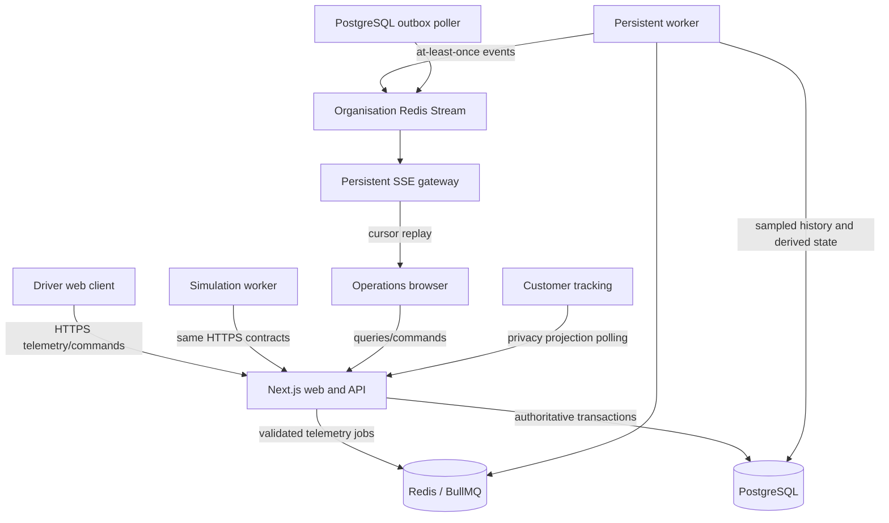
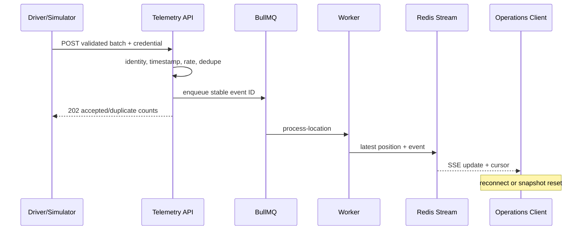

# DeliveryOS Architecture

## System view

## Authoritative domain

`Delivery` is an operational aggregate with ordered stops, current assignment, risk, ETAs, and a version. A pure state machine is the only source of lifecycle transitions. The service transaction persists the updated projection and immutable `DomainEvent`; it does not implement full event sourcing.

The MVP starts with one pickup and one drop-off. Ordered `DeliveryStop` rows allow later multi-stop work without introducing optimisation now. `DeliveryAssignment` and `Route` are historical records rather than overwritten blobs.

## Tenancy and authentication

Better Auth owns users, sessions, accounts, and password verification in PostgreSQL. `Membership` adds DeliveryOS roles. Page redirects are only a user-experience guard; every query and command verifies the session, membership, organisation, and—where required—the linked driver.

Tenant IDs are stored on operational rows for indexing and defence in depth. Cross-tenant resources are returned as not found. Composite tenant constraints should be extended whenever new cross-aggregate relations are introduced.

## Telemetry and realtime

Latest location and freshness live in Redis; PostgreSQL receives sampled snapshots. Domain events are published through an outbox. SSE tickets last one minute and scope one user to one organisation. A client whose cursor has expired refetches the authoritative operations snapshot.

## ETA, geofences, and deviations

ETA starts with provider leg durations and declines using remaining-route ratio. Service time is included before pickup. Only material ETA or risk changes are persisted. Geofence entry requires two samples over five seconds. Deviation requires three accurate samples over 150 metres for 30 seconds and clears below 100 metres. Neither derived signal completes a delivery.

## Simulation

Simulation state includes a versioned scenario, seed, logical clock, speed, deterministic PRNG state, route progress, and scheduled exception decisions. Logical time advances faster than wall time while emitted observations use wall time, preserving normal freshness validation. The worker authenticates as scoped simulated drivers and calls the normal telemetry and lifecycle APIs.

## Providers and failure

MapLibre renders the map; provider-neutral interfaces isolate Mapbox geocoding and directions. Fixture adapters make CI and local development deterministic. Stored routes remain usable when Mapbox is unavailable, while non-map workflows continue normally.

## Deployment

Next.js runs on Vercel near an EU Neon PostgreSQL database. Persistent gateway and worker process groups run on Fly.io in London. Redis is a managed TCP endpoint compatible with BullMQ. Local development substitutes Docker Compose PostgreSQL and Redis.
