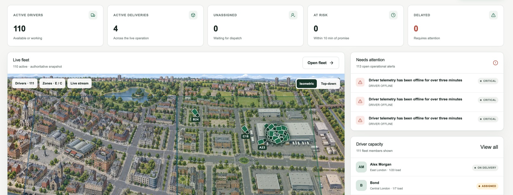

# DeliveryOS

Dispatch work, follow the fleet, and reconstruct what happened. DeliveryOS is a last-mile delivery operations app for dispatchers and drivers: a live map, a delivery workflow, customer tracking, and a simulator that uses the same pipelines as a real driver.

[](https://github.com/andrewbaisden/deliveryos/actions/workflows/ci.yml)
[](https://github.com/andrewbaisden/deliveryos)
[](#license-and-responsible-use)



Open the operations overview to see who is working, which deliveries are active, and what needs attention. Open the live fleet to watch drivers move across East and Central London. Create and assign a delivery, then follow that job in the driver app through to proof of delivery. A customer with a tracking link sees a reduced page, separate from the internal board.

## What it does

- **Operations overview.** Active drivers, deliveries, unassigned work, jobs at risk, and delays, with alerts and driver capacity beside the map.
- **Deliveries.** Search, create, and assign jobs. Status changes follow an explicit delivery lifecycle, and each change is kept as an event.
- **Drivers.** A roster for dispatch, and a driver flow from assignment through proof of delivery.
- **Live fleet.** Driver positions come from telemetry. The map is a built-in East and Central London scene, in isometric or top-down view.
- **History and analytics.** An event history and an operations summary for the organisation.
- **Customer tracking.** A public link with a reduced view. An approximate position appears only within one kilometre of the drop-off, and no more often than every 30 seconds.
- **Simulation.** Normal shift, peak period, disruption, and late shift. Simulated drivers call the same telemetry and command APIs as a real driver. A seed makes a run repeatable.

Built with Next.js, TypeScript, PostgreSQL, Prisma, Redis, and BullMQ. The stack, environment, and deployment target are in [SPECIFICATION.md](./SPECIFICATION.md).

## Getting started

### Prerequisites

- [Node.js](https://nodejs.org/) 22 or newer. Continuous integration uses Node.js 24.
- [pnpm](https://pnpm.io/) 12. `packageManager` in `package.json` is pnpm 12.3.4.
- [Docker](https://www.docker.com/), for PostgreSQL and Redis.

### Install

```bash
git clone https://github.com/andrewbaisden/deliveryos.git
cd deliveryos
pnpm install
cp .env.example .env
```

`.env.example` is enough to boot the app on your machine. The example auth secret, simulation secret, and demo passwords are for that local database. Replace `BETTER_AUTH_SECRET` and `SIMULATION_CREDENTIAL_SECRET` before anyone else can reach the app. Generate a secret with:

```bash
node -e "console.log(require('crypto').randomBytes(32).toString('hex'))"
```

### Environment variables

| Variable | Required | Purpose |
| --- | --- | --- |
| `DATABASE_URL` / `DIRECT_URL` | Yes | PostgreSQL. The example points at `localhost:5434`. |
| `REDIS_URL` | Yes | Redis for queues, latest positions, and the realtime stream. |
| `BETTER_AUTH_SECRET` | Yes | Signs sessions. Generate your own. |
| `BETTER_AUTH_URL` | Yes | Canonical app URL. `http://localhost:3000` locally. |
| `NEXT_PUBLIC_APP_URL` | Yes | Browser app URL. Keep it in step with `BETTER_AUTH_URL`. |
| `NEXT_PUBLIC_RUNTIME_URL` | Yes | Realtime gateway. `http://localhost:4000` locally. |
| `WEB_ORIGIN` | Yes | Origin allowed to open the realtime stream. |
| `SIMULATION_CREDENTIAL_SECRET` | Yes | HMAC secret for simulator driver credentials. |
| `MAPBOX_SECRET_TOKEN` | No | Server-only geocoding and directions. Without it, create and assign use the London fixture. |
| `DEMO_FLEET_TICKER` | No | Demo movement on the map. On outside production when unset. |
| `DEMO_*_EMAIL` / `DEMO_*_PASSWORD` | No | Local demo accounts. Defaults are in `.env.example`. |
| `SENTRY_DSN` / `NEXT_PUBLIC_POSTHOG_KEY` | No | Optional error reporting and product analytics. Leave unset and both stay off. |

Every variable, including the soak-test settings, is listed in [SPECIFICATION.md](./SPECIFICATION.md).

### Set up the database and run

PostgreSQL is published on port **5434** so it does not collide with another local Postgres on 5432. Redis is on 6379.

```bash
docker compose up -d
pnpm db:generate
pnpm db:migrate
pnpm db:seed
```

Leave Docker running. `pnpm db:seed` restores the demo organisation, the accounts below, and a Stratford to Covent Garden delivery. Run it again whenever you want that fixture back.

The app is three processes. Start each command in its own terminal, from the repository root:

| Script | What it runs | You need it for |
| --- | --- | --- |
| `pnpm dev` | Next.js on [http://localhost:3000](http://localhost:3000) | The UI, sign-in, and APIs |
| `pnpm dev:runtime` | Realtime gateway on [http://localhost:4000](http://localhost:4000) | The live map stream |
| `pnpm dev:worker` | Background worker | Telemetry, the demo fleet ticker, simulation, and alerts |

```bash
pnpm dev
```

```bash
pnpm dev:runtime
```

```bash
pnpm dev:worker
```

`pnpm dev` on its own is enough to sign in and click through the pages. For a moving fleet, keep the runtime and the worker running as well. In development the worker posts demo positions every two seconds for drivers who are outside a running simulation. Set `DEMO_FLEET_TICKER=false` to turn that off. A simulation run owns its own drivers while it is running or paused.

Open [http://localhost:3000](http://localhost:3000). If that port is busy, Next.js may start on 3001. Point `BETTER_AUTH_URL` and `NEXT_PUBLIC_APP_URL` at the port you actually get, then restart `pnpm dev`.

### Demo accounts

The default password is `ChangeMe123!` unless you set the `DEMO_*_PASSWORD` values in `.env`.

| Role | Email | Home |
| --- | --- | --- |
| Admin | `admin@deliveryos.local` | `/ops` |
| Dispatcher | `dispatcher@deliveryos.local` | `/ops` |
| Driver | `driver@deliveryos.local` | `/driver` |

The demo tracking page is `/track/deliveryos-demo-track-18421`.

### Checks

```bash
pnpm check
pnpm typecheck
pnpm test
pnpm test:e2e
pnpm build
```

What each suite covers is in [TESTING.md](./TESTING.md). Continuous integration runs these on every push and pull request.

## Documentation

| Guide | Read it for |
| --- | --- |
| [SPECIFICATION.md](./SPECIFICATION.md) | Product scope, stack, environment, quality gates, and deployment |
| [ARCHITECTURE.md](./ARCHITECTURE.md) | System design, telemetry, realtime, and simulation |
| [DECISIONS.md](./DECISIONS.md) | Architecture decision records |
| [TESTING.md](./TESTING.md) | How the test suites fit together and how to run them |
| [AGENTS.md](./AGENTS.md) | Conventions for people and coding agents changing this repo |
| [AI_ENGINEERING.md](./AI_ENGINEERING.md) | How AI assistance was used on this project |

## License and responsible use

**Release 0.1.0.** This repository does not include a software license file. You can read the code and run it locally. Copying it into another project needs the author's permission. A `LICENSE` file will replace this note if one is added later.

DeliveryOS is an independent demonstration project. Mapbox, when you connect it, remains a separate service under its own terms.

Anyone running or extending DeliveryOS should keep these rules:

- Treat location as sensitive. Keep precise coordinates, street addresses, tracking tokens, passwords, and customer contact details out of logs.
- The public tracking page is a reduced view. It shows an approximate position only while the driver is within one kilometre of the drop-off, rounds that point, and updates it on a 30-second bucket. The response omits internal notes and the rest of the fleet. Keep that boundary if you change the tracking API.
- Demo emails and the password `ChangeMe123!` belong to a local database. Replace them, and replace the example auth secrets, before the app is reachable by anyone else.
- A Mapbox browser token, if you add one, must be restricted to your site's URLs. The geocoding and directions token stays on the server. Follow [Mapbox's terms](https://www.mapbox.com/legal/tos) for whatever tokens you use.
- Simulation calls the same APIs as a real driver so the product can be exercised end to end. Keep simulated work labelled as simulated, and keep a demo fleet out of a real operation.
- PostgreSQL is the record of delivery state, assignments, and events. Redis holds queues and the latest positions.

How the web app, the database, and the realtime worker are meant to be hosted is in [SPECIFICATION.md](./SPECIFICATION.md).
